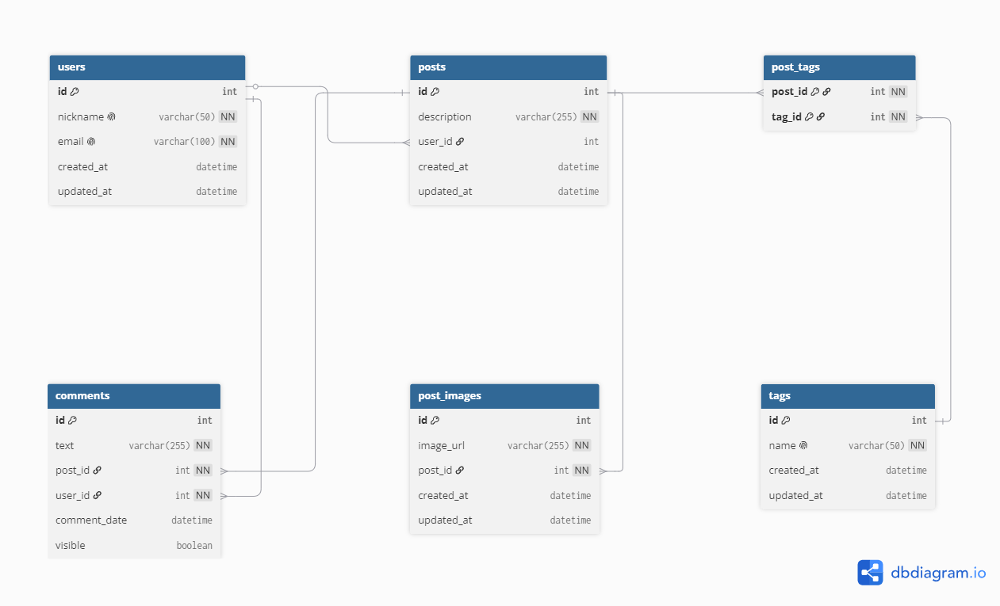

# Estrategias de Persistencia 
# Trabajo Practico N°1


# 📌 Proyecto Anti-Social - Backend

## 🗂️ Diagrama de la base de datos



---

# ⚙️ Tecnologías utilizadas

- JavaScript (ES6)
- Node.js
- Express.js
- Sequelize ORM
- SQLite3
- Joi (validación de esquemas)
- Nodemon (entorno de desarrollo)
- Sequelize CLI

---

# ⚙️ Configuración inicial del proyecto

## 📦 Instalación de dependencias

### Express

```bash
npm i express
```

Framework para la creación del servidor HTTP y manejo de rutas.

### Sequelize ORM

```bash
npm i sequelize
```

ORM utilizado para modelar la base de datos desde JavaScript.

### SQLite

```bash
npm i sqlite3
```

Base de datos liviana utilizada en desarrollo.

### Joi (validaciones)

```bash
npm i joi
```

Librería para validación de datos de entrada en schemas.

### Dependencias de desarrollo

```bash
npm i -D sequelize-cli nodemon
```

- `sequelize-cli`: manejo de modelos y migraciones
- `nodemon`: reinicio automático del servidor

---

## 🚀 Inicialización de Sequelize

```bash
npx sequelize-cli init
```

Genera:

- `config/`
- `models/`
- `migrations/`
- `seeders/`

Reorganizado luego en `src/db/`.

---

## 🧱 Estructura del proyecto

```
src/
│
├── controllers/
├── routes/
├── middlewares/
├── schemas/
│
├── db/
│   ├── config/
│   ├── models/
│   ├── migrations/
│   ├── seeders/
│
└── main.js
```

---

## 🧠 Modelado de la base de datos

### 👤 User

- `id`
- `nickname` (UNIQUE)

**Relaciones:**
- 1 User → N Posts
- 1 User → N Comments

### 📝 Post

- `id`
- `description`
- `userId`

**Relaciones:**
- User → Post (1:N)
- Post → Comments (1:N)
- Post → Images (1:N)
- Post ↔ Tags (N:M)

### 💬 Comment

- `id`
- `content`
- `userId`
- `postId`

**Relaciones:**
- pertenece a User
- pertenece a Post

### 🖼️ PostImage

- `id`
- `imageUrl`
- `postId`

**Relación:**
- pertenece a Post

### 🏷️ Tag

- `id`
- `name` (UNIQUE)

**Relación:**
- N:M con Post

### 🔗 PostTags

- `postId`
- `tagId`

Tabla intermedia N:M.

---

## 🔄 Relaciones del sistema

- User 1 → N Post
- User 1 → N Comment
- Post 1 → N Comment
- Post 1 → N PostImage
- Post N ↔ N Tag

---

## 🧩 Arquitectura del backend

### Controllers

- CRUD completo
- lógica de negocio
- manejo de respuestas HTTP

### Middlewares

- Validación de params
- Validación de existencia en DB
- Validación de schemas (Joi)

### Schemas

- `userSchema`
- `postSchema`
- `commentSchema`
- `tagSchema`
- `postImageSchema`

---

## 🧾 Endpoints de la API

### 👤 Users

```
GET    /users
GET    /users/:id
POST   /users
PUT    /users/:id
DELETE /users/:id
```

### 📝 Posts

```
GET    /posts
GET    /posts/:id
POST   /posts
PUT    /posts/:id
DELETE /posts/:id
```

### 💬 Comments

```
GET    /comments
GET    /comments/:id
POST   /comments
PUT    /comments/:id
DELETE /comments/:id
```

### 🖼️ Post Images

```
GET    /images
GET    /images/:id
POST   /images
PUT    /images/:id
DELETE /images/:id
```

### 🏷️ Tags

```
GET    /tags
GET    /tags/:id
POST   /tags
PUT    /tags/:id
DELETE /tags/:id
```

---

## 🔐 Validaciones implementadas

- Validación de IDs en rutas
- Validación con Joi (schemas)
- Verificación de existencia en DB
- Integridad referencial
- Unique constraints en modelos

---

## 🧪 Testing del sistema

Se realizaron pruebas de:

- CRUD de usuarios
- CRUD de posts
- CRUD de comments
- CRUD de tags
- asociación Post ↔ Images
- asociación Post ↔ Tags
- integridad de relaciones

---

## 🧠 Decisiones de diseño

- Arquitectura en capas
- Sequelize ORM
- Relaciones N:M explícitas (PostTags)
- Validación doble (middleware + schema)
- Diseño modular y escalable

---
# 🔐 Configuración de variables de entorno (.env)

El proyecto utiliza la librería `dotenv` para gestionar variables de entorno, permitiendo configurar parámetros sensibles o variables de ejecución sin modificar el código fuente.

Esto mejora la portabilidad del sistema entre distintos entornos (desarrollo, testing y producción).

---

## 📁 Archivo `.env`

En la raíz del proyecto se debe crear un archivo `.env` con la siguiente estructura:

```env
PORT=3000
NODE_ENV=development
DB_STORAGE=./src/db/database.sqlite
```

---

## ⚙️ Variables utilizadas

| Variable | Descripción |
|----------|-------------|
| `PORT` | Puerto donde se ejecuta el servidor |
| `NODE_ENV` | Entorno de ejecución (`development` / `production` / `test`) |
| `DB_STORAGE` | Ruta del archivo SQLite |

---

## 🚫 Seguridad

El archivo `.env`:

- ❌ No debe subirse a GitHub
- ❌ Debe agregarse al `.gitignore`

```
.env
node_modules
```

---

## 🚀 Uso en el proyecto

El archivo `.env` se carga mediante:

```js
require("dotenv").config();
```

Y las variables se acceden con:

```js
process.env.PORT
process.env.NODE_ENV
process.env.DB_STORAGE
```

---

## 📌 Beneficio

Este enfoque permite:

- Cambiar configuración sin modificar código
- Adaptar el proyecto a otras máquinas fácilmente
- Mantener buenas prácticas de seguridad
- Preparar el proyecto para despliegue

---

## 📌 Estado del proyecto

- ✔ CRUD completo
- ✔ Relaciones implementadas
- ✔ Validaciones funcionando
- ✔ Base de datos operativa
- ✔ Arquitectura escalable
- ✔ Proyecto listo para entrega final